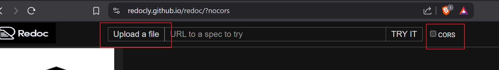
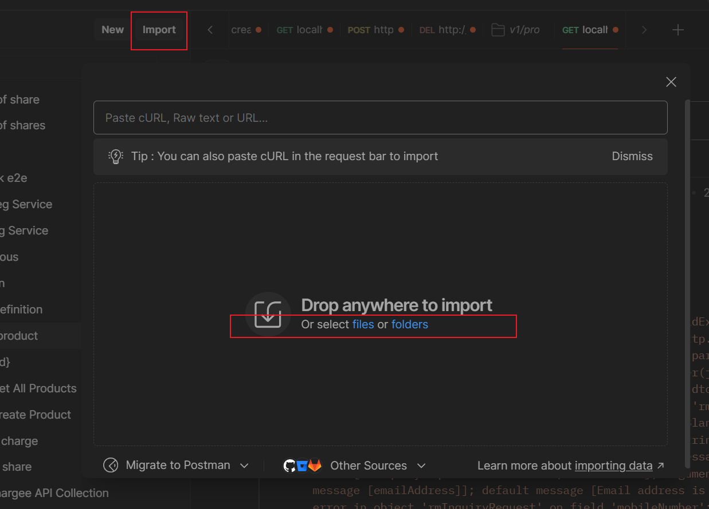
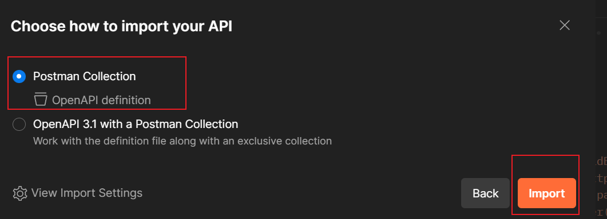

# Getting Started

### Reference Documentation
open redoc to view open api :

Go to url and uncheck "cors"

* [open redoc](https://redocly.github.io/redoc/)
  upload rm_pull_create_openapi_spec.yaml file to view open api specs

### Guides
import this yaml file via postman collection

